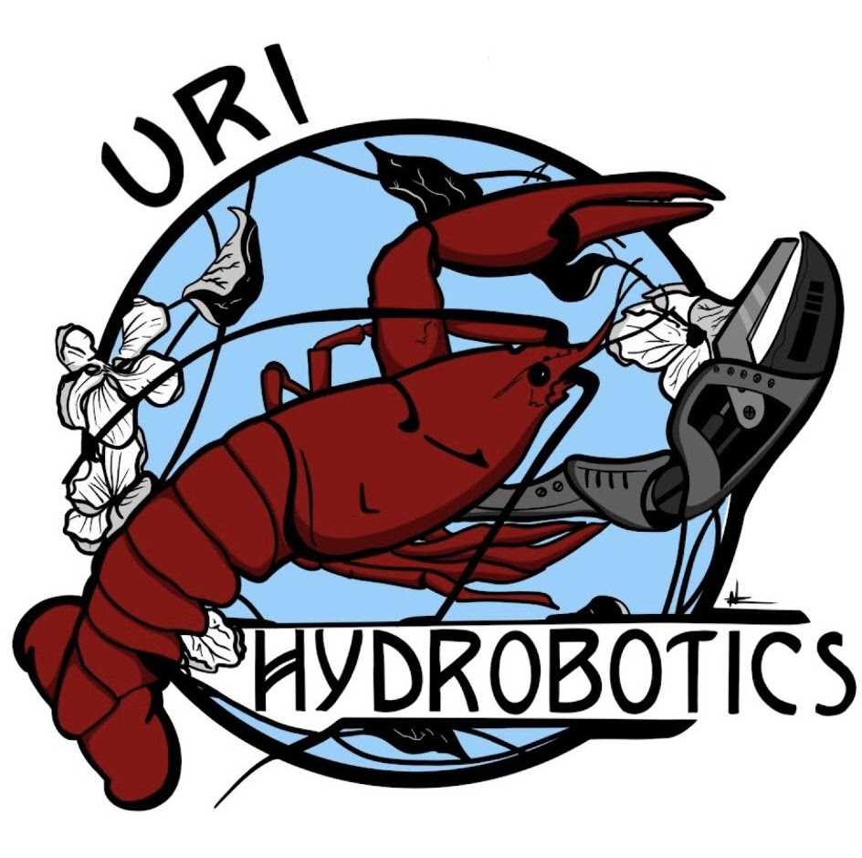
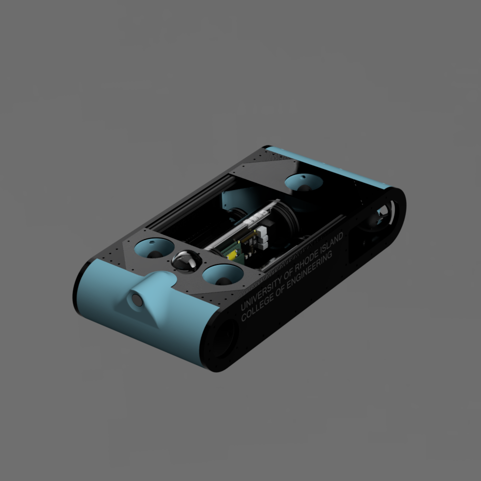

    <h1 align="center">University of Rhode Island</h1>
    <h1 align="center">Hydrobotics</h1>

    

    Hello, and welcome to the URI Hydrobotics AUV codebase. Below will have some technical documentation, description of this here ol' repository and some other important things you should read before 

     
    

# What is this?
This is a repo for our custom software the powers the Tardigrade AUV. This is not based on ROS or anything else. While this may be used in other AUVs, it is specifically desgined for Tardigrade. The code base is in heavy development and is not refined at the moment, one a minimum viable product has been developed, the refining process will occur.

# Installation
Each directory includes either a makefile or a build.sh script. cmake will be fully adopted in the future.
# Requirements
TODO
# History

    
     
    This is the Tardigrade V1, our first concept AUV for the RoboSub competition to compete in the Summer of 2024.
     
    

[Sponsorship Button]: https://img.shields.io/badge/Consider_Sponsoring_Us-8ac0e2?style=for-the-badge
[TDR Button]: https://img.shields.io/badge/Checkout_Our_Technical_Design_Report-8ac0e2?style=for-the-badge
[TDR]: img/2024_tdr.pdf
[SponsorFile]: img/2024_sponsorsheet.pdf
[empty]: #
